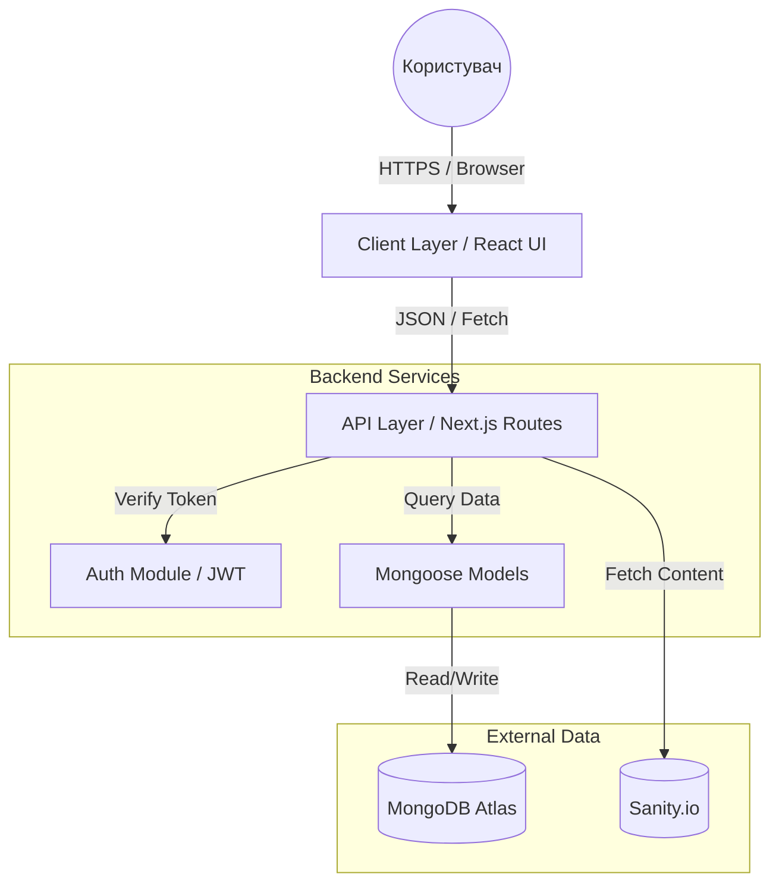
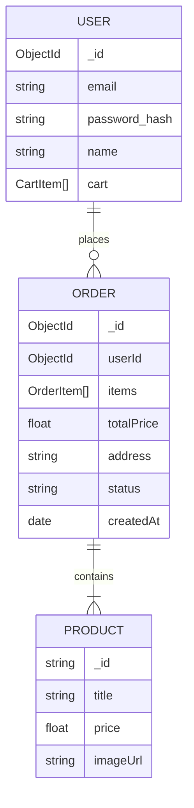
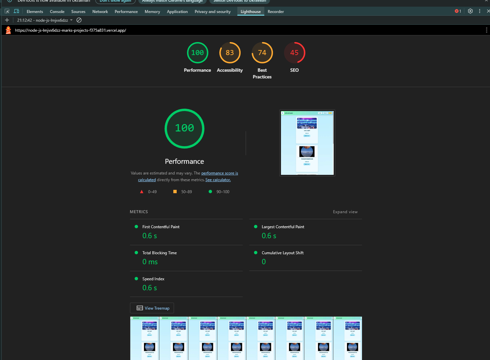
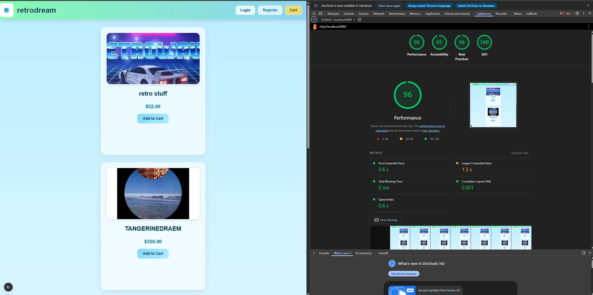

# RetroDream Store 🎮

**RetroDream** — Full-stack веб-застосунок для електронної комерції, спеціалізований на продажу ретро-консолей та аксесуарів. Проєкт демонструє сучасну серверну архітектуру на базі Next.js, забезпечуючи високу продуктивність і SEO-оптимізацію.

---

## 🛠 Технологічний стек

- **Framework:** Next.js 15 (React)
- **Стилізація:** Styled-components
- **Backend:** Next.js API Routes (Serverless Functions)
- **База даних:** MongoDB (Mongoose ODM)
- **CMS:** Sanity.io
- **Автентифікація:** JWT + Secure Cookies
- **Тестування:** Jest, Node-Mocks-HTTP
- **CI/CD:** GitHub Actions

---

## 🏗 Архітектура та Дизайн (Лабораторна №2)

### Архітектурні шари
1. **Client Layer (`/src/components`)** — React UI компоненти.
2. **API Layer (`/src/pages/api`)** — логіка серверних ендпоінтів.
3. **Data Layer (`/src/models`)** — Mongoose-схеми.
4. **Service Layer (`/src/lib`)** — логіка БД та автентифікації.

### Діаграма компонентів


### ER-Діаграма


---

## 🚀 Основний функціонал
- Автентифікація з JWT та bcrypt
- Каталог товарів із Sanity CMS
- Кошик збережений у MongoDB
- Оформлення замовлення
- Адаптивний UI

---

### Ключові сценарії (Data Flow)

Опис потоку даних для основних бізнес-процесів застосунку:

**1. Додавання товару в кошик:**
1.  **User Action:** Користувач натискає кнопку "Add to Cart" на сторінці товару.
2.  **Client:** React-компонен відправляє асинхронний `POST` запит на ендпоінт `/api/cart/addItem`.
3.  **Server (Auth):** Middleware перевіряє наявність та валідність `JWT` токена в куках.
4.  **Server (Logic):** Знаходить користувача в колекції `Users` (MongoDB). Перевіряє, чи є товар вже в масиві `cart`.
    *   *Якщо є:* збільшує поле `quantity`.
    *   *Якщо немає:* додає новий об'єкт товару в масив.
5.  **Database:** Виконується `user.save()`, оновлюючи стан у базі даних.

**2. Оформлення замовлення (Checkout):**
1.  **User Action:** Користувач заповнює форму доставки та натискає "Place Order".
2.  **Client:** Відправляється `POST` запит на `/api/orders/create` з даними форми та вмістом кошика.
3.  **Server (Validation):** Бекенд валідує вхідні дані (адреса, сума).
4.  **Database (Transaction):**
    *   Створюється новий документ у колекції `Orders`.
    *   Знаходиться документ поточного користувача в колекції `Users`.
    *   Поле `cart` очищається (`[]`).
5.  **Response:** Сервер повертає ID створеного замовлення, клієнт перенаправляється на головну.

---

## ⚡ Оптимізація та Продуктивність (Google Lighthouse)

В рамках роботи над покращенням якості програмного забезпечення було проведено аудит та оптимізацію основних показників веб-застосунку (Core Web Vitals).

### 📊 Результати до та після

| До (Проблеми з LCP, SEO) | Після (Виправлено) |
|:---:|:---:|
|  |  |

### 🛠️ Впроваджені технічні рішення

1. **Largest Contentful Paint (LCP):**
   - Замінено стандартний тег `` на компонент `next/image` для автоматичного стиснення (WebP) та адаптації розмірів.

2. **SEO та Метадані:**
   - Додано глобальний компонент `<Head>` з мета-тегами `description`, `viewport` та `robots`.
   - Налаштовано файл `robots.txt` для індексації.

3. **Доступність (Accessibility):**
   - Виправлено семантичну структуру заголовків.
   - Додано атрибут `lang="en"` в `_document.js`.

4. **Best Practices:**
   - Налаштовано коректні статус-коди API (заміна помилкового 401 на 200 при перевірці сесії).
---
## ⚙️ Інструкція з запуску

### Вимоги
- Node.js v18+
- MongoDB Atlas
- Sanity.io проект

### 1. Клонування
```bash
git clone https://github.com/your-username/retrodream.git
cd retrodream
```

### 2. Встановлення залежностей
```bash
npm install
```

### 3. Налаштування `.env.local`
```env
MONGODB_URI=mongodb+srv://<user>:<password>@cluster.mongodb.net/dbname
JWT_SECRET=your_super_secret_key
NEXT_PUBLIC_SANITY_PROJECT_ID=your_sanity_id
NEXT_PUBLIC_SANITY_DATASET=production
```

### 4. Запуск
```bash
npm run dev
```

Відкрити: http://localhost:3000

---

## 🧪 Тестування
```bash
npm test
